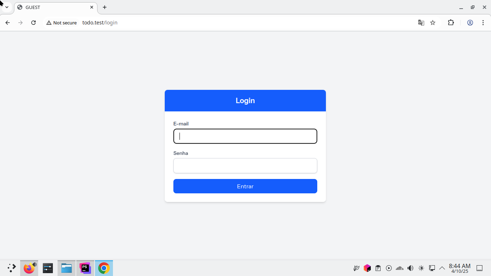
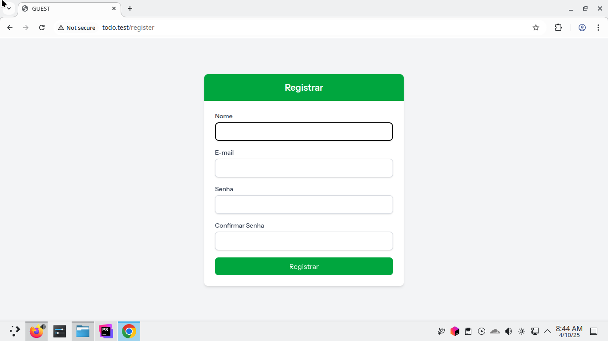
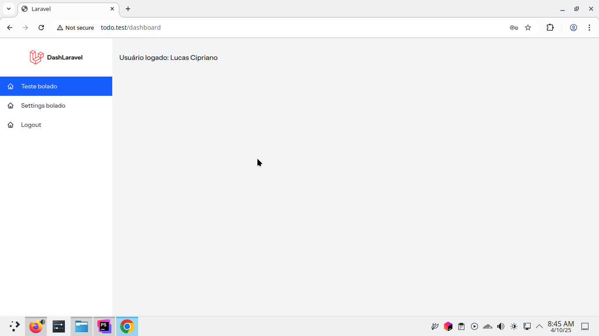

## LaraDash + Livewire3

Painel administrativo feito com Laravel 12, Livewire 3 e Tailwind.

- [x]  Login
- [x] Register
- [x]  Painel
- [ ]  CRUD de clientes
  - Falta criar o layout bonito  
  - VALIDAÇÕES
  - ~~Alterar as chamadas para o reload, usar algo do livewire e tirar chamda do bd~~ Resolvido com dispach e On
- [ ]  CRUD de produtos
- [ ]  Deixar responsivo

